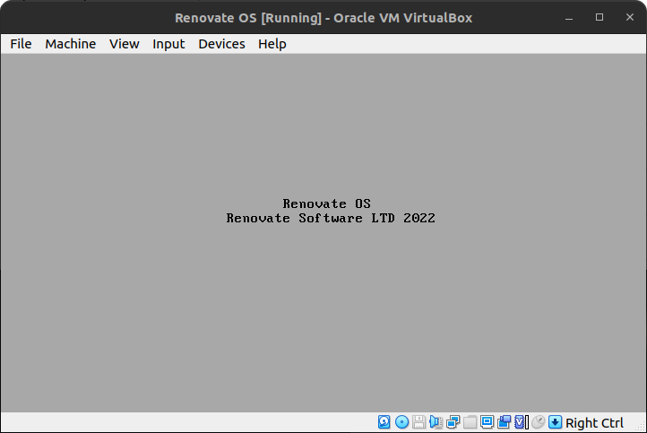

# Renovate-OS
 Official repo for Renovate OS, written entirely in C and assembly language.
 
 
 
## What is Renovate OS?
It's an opensource operating system that can execute RenGets both natively and remotely on an external server.

## But why basic C?
It offers a programming interface that is more convient than assembly language. However, assembly language will be used to implement core functionality as that is the only way this can be accomplished. 

## Why not just use the Linux kernel?
Building an operating system from the ground up that can run on bare metal is quite the accomplishment. By using a custom codebase, Renovate OS can be made far more versitile and even faster than Linux. Renovate OS is supposed to be the prime example of what a perfectly balanced platform should look like; with the implementation of only running RenGets that meet our specifications. 

## To-Do List
- [x] Successful build for printing text.
- [ ] Implement boot process that calls the main methods.
- [ ] Hardware drivers for user input. 🚧
- [ ] Sound driver for error reporting.
- [ ] Implement local filesystem. 🚧
- [ ] Process management. 🚧
- [ ] Programming interface. 🚧
- [ ] Graphics driver. 🚧
- [ ] Ethernet network driver.
- [ ] More in the pipeline coming soon..
